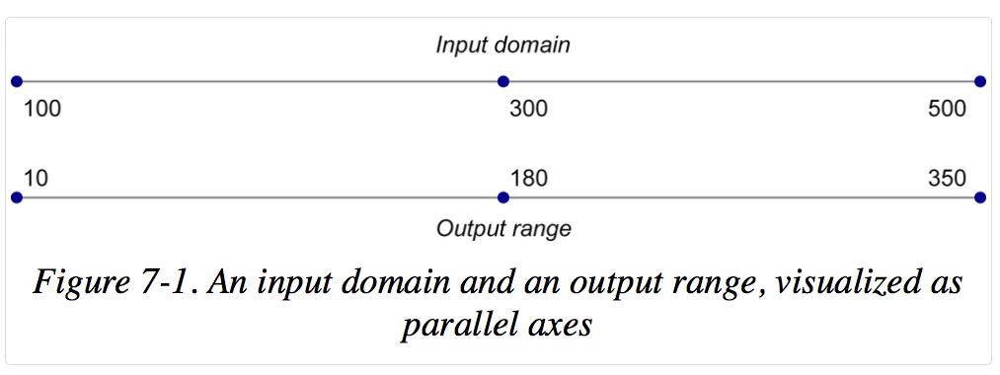

#Scales

##Scales are functions that map from an input input domain to an output range.

[Mike Bostock's blog on d3 scale](https://github.com/mbostock/d3/wiki/Quantitative-Scales)

D3 scales are functions with parameters that you define.
Once they are created, you call the scale() function,
pass it a data value, and it returns a scaled output value.

Scales are an optional feature in D3; you don't have to use them, if you prefer to do the math
yourself. However, using scales can greatly simplify the code needed to map a
dimension of data to a visual representation.

###A D3 Scale is _just a mathematical relationship_, with _no direct visual output_.

There are different types of [scales](https://github.com/mbostock/d3/wiki/Scales):

*   Quantitative Scales
    *   [linear](https://github.com/mbostock/d3/wiki/Quantitative-Scales#linear)

    *   sqrt
    *   pow
    *   log
    *   quantize
    *   quantile

*   [Ordinal Scales](https://github.com/mbostock/d3/wiki/Ordinal-Scales)
    *   Ordinal scales use nonquantitative values (like category names) for output.
    *   Ordinal scales re typically used for ordinal data, typically categories with some inherent _order_ to them. E.g. grade A, grade B, grade C
    *   Ordinal values are typically non-numeric. They are usually categorical values.

    *   Handy preset ordinal scales that output either 10 or 20 categorical colors.
        *   d3.scale.category10()
        *   d3.scale.category20()
        *   d3.scale.category20b()
        *   d3.scale.category20c()

*   [Time Scales](https://github.com/mbostock/d3/wiki/Time-Scales)
    *   d3.time.scale()
    *   Used for date and time values, with special handling of ticks for dates.

A scale has **input domain** and **output range**

Input Domain is the range of possible input data values.

Output range is the range of possible output values, commonly used as display values in pixel units.

###Normalization

Normalization is the process of mapping a numeric values to a new value
between 0 and 1, based on the possible minimum and maximum values.

With Linear scales, D3 automatically handles the math
required for the normalization process.

###Creating a Scale

d3.scale.<type>
e.g
var scale = d3.scale.linear();

setting input domain

scale.domain([100, 500]);

setting output range

scale.range([10, 350]);

getting scale output:
scale(100); // returns 10

Instead of specifying the fixed or hardcoded values for the domain,
always specify using the d3.min() and d3.max() values.

[scale basic example code](../basic/scales/scale-basic.html)

Both d3.max() and d3.min() take either one or two arguments.
The first argument must bve a reference to the array of values.
The second argument is an accessor function. This is optional is the input
array is a simple one-dimensional array of numeric values like [1,2,5,10,1000]

The accessor function is an anonymous function to which max() hands off
each value in the data array, one at a time as d.
The accessor function specifies how to access the values to be used for the comparision.

[scatter plot using scale example code ](../basic/scales/scaling-scatter-plot.html)

Useful methods provided by d3.scale.linear()

*   nice()

*   rangeRound()

*   clamp()

e.g.
var scale = d3.scale.linear()
                    .domain([0.123, 4.567])
                    .range(0, 500])
                    .nice(); // or clamp(true);

### Linear vs Ordinal

To set the domain of an ordinal scale, you typically specify an array with the category values.

.domain(["freshman", "sophomore", "junior", "senior"])

To set the domain of an linear scale, you typically specify min and max values.

.domain(0, 100)

Linear scale uses continuous range
.range(min, max)

Ordinal scale uses discrete ranges, meaning the output values are determined in advance, and could
be numeric or not.
It supports _**range banding**_ . rangeBands() takes a low and high value and automatically
divide it into even chunks or "bands", based on the length of the domain.

E.g. rangeBands([0, w])

if there are 20 categorical values in the domain and width = 600, then

(600-0)/ 20 = 30
So, each band will be 30 "wide".

rangeBands([0, w], 0.05)

The second parameter is optional. When specified, it is used to specify the width for each band.
In this case, 5% of the width of each band is used for spacing b/n the bands.

.rangeRoundBands() is similar to rangeBands(), excepts the output range values are rounded
to the nearest whole pixel. So, 12.345 is rounded to 12.

